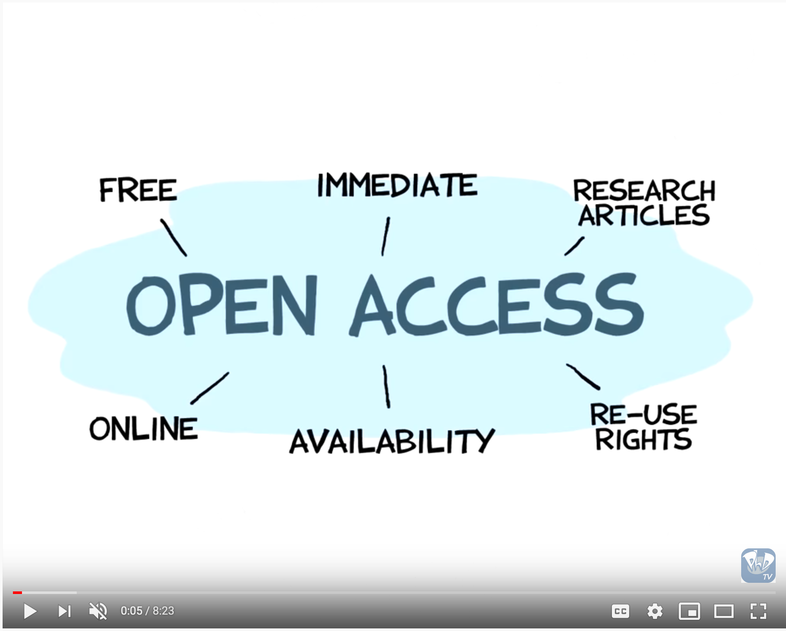

## Establishing Policies
This section provides an overview of more theoretical publishing best practices, with a focus on publishing ethics, open access, peer review, copyright and licensing, and accessibility. Particularly if you are new to journal publishing, please take the time to familiarize yourself with this information, and email your [library publishing contact](contacts.md) if you have questions.

### Open Access
There are two dominant access models for scholarly journals: subscription-based and open access. To receive support from your CSU library, your journal must be committed to an open access model, which [SPARC](https://sparcopen.org/open-access/) defines as “the free, immediate, online availability of research articles combined with the rights to use these articles fully in the digital environment.”

In addition to selecting your journal’s access model under Distribution Settings, you should also clearly state your journal’s open access policy, generally in the About the Journal section of the [Journal Settings](setting1.md).
