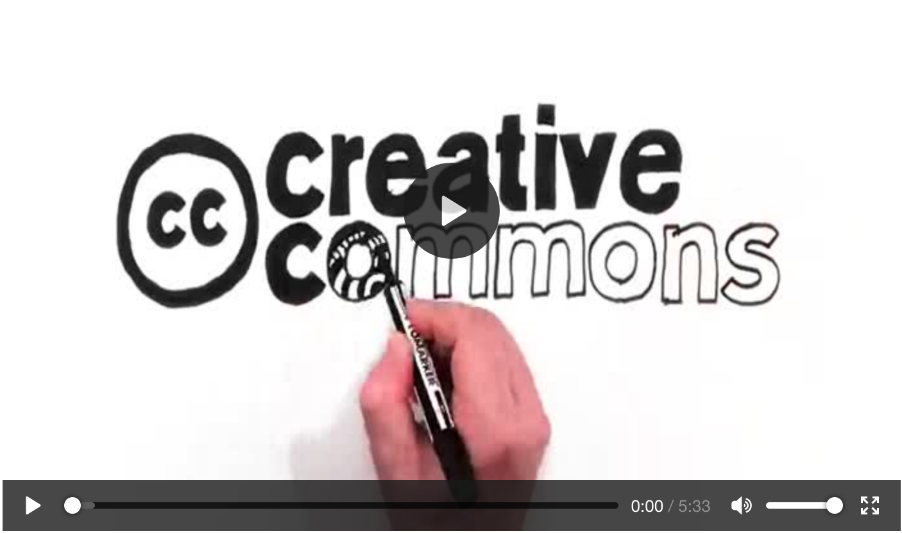
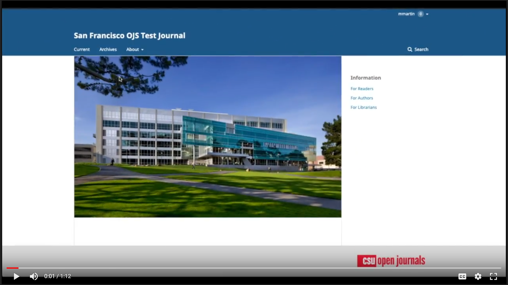

## Copyright and Licensing

Rather than requiring authors to transfer their copyright to the journal, which is a common practice among subscription-based journals, the CSU libraries require affiliated journals to allow authors to retain their copyright. As described below, authors should be encouraged to publish their work under an open license to supplement the limited uses afforded by copyright. At a minimum, and as described in the [author agreements section](authors.md), authors must grant the Library a nonexclusive, irrevocable, worldwide license to disseminate their work electronically.

As part of your journal’s copyright policy, you should also clearly stipulate the terms under which authors can self-archive their work (i.e., add it to repositories, personal websites, ResearchGate, etc.). The CSU Libraries strongly recommends that journals add their self-archiving policies to [SHERPA/RoMEO](https://v2.sherpa.ac.uk/romeo/) or a similar database, which is a requirement should you plan to apply for your journal to be indexed in the Directory of Open Access Journals [(DOAJ)](https://doaj.org). Please email your [library publishing contact](contacts.md) for assistance with for assistance with SHERPA/RoMEO’s [Suggest a New Journal form](https://sherpa.ac.uk/forms/new-journal.php?service-identifier=romeo2) as well as with any other questions.

## Open Licensing

Ideally, open access should entail more than just making scholarly publications free to read. Whenever possible, open access publications should also be “free of unnecessary copyright and licensing restrictions” to ensure the work can be widely used (see Peter Suber’s [overview](https://sparcopen.org/our-work/gratis-and-libre-open-access/) of gratis and libre open access).

To achieve this, the CSU libraries strongly recommend that journals published by our students and faculty require authors to publish their work under a [Creative Commons (CC) license](https://creativecommons.org/licenses/). This is considered a best practice in the open access publishing community, and it is required for publishers seeking [Open Access Scholarly Publishers Association (OASPA) membership](https://oaspa.org/best-practices-licensing-attribution-need-to-know/).

## Choosing a Creative Commons (CC) License

The [CC-BY license](https://creativecommons.org/licenses/by/4.0/) is preferred, as it has the fewest restrictions on use while still requiring that “appropriate credit” be given to the creator(s), but there are a number of CC licenses from which to choose. Consider selecting a default license for all content in your journal and allowing individual authors to choose an alternative CC license for their work as needed. The [CC License Chooser](https://creativecommons.org/choose/) is a helpful tool, and the various CC licenses are also described in the following video.

## OJS Setup

Once you decide on your journal’s copyright policy and default Creative Commons license, be sure to fill out the fields on the Permissions page under Distribution Settings in OJS. The following video will walk you through that process:

Based on this: https://jps.library.utoronto.ca/index.php/pubguide/copyright

When publishing individual articles, you will also have the opportunity to amend the copyright and licensing information, if needed.

Create a separate video for this?
