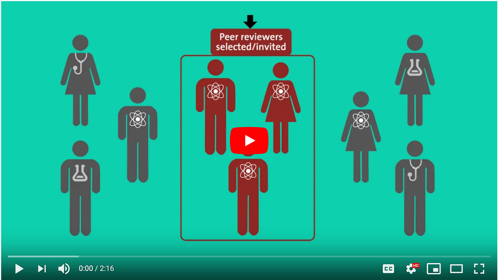

## Establishing Policies
This section provides an overview of more theoretical publishing best practices, with a focus on publishing ethics, open access, peer review, copyright and licensing, and accessibility. Particularly if you are new to journal publishing, please take the time to familiarize yourself with this information, and email your [library publishing contact](contacts.md) if you have questions.

### Peer Review

Review policies should be clearly described on your journal’s website, generally within the About the Journal and Sections areas of [Journal Settings](https://docs.pkp.sfu.ca/learning-ojs/en/journal-setup#masthead).

As stated in the [Principles of Transparency and Best Practice in Scholarly Publishing](https://doaj.org/bestpractice):

> *Journal content must be clearly marked as whether peer reviewed or not. Peer review is defined as
> obtaining advice on individual manuscripts from reviewers expert in the field who are not part of
> the journal's editorial staff. This process, as well as any policies related to the journal's peer
> review procedures, shall be clearly described on the journal's Web site, including the method of
> peer review used. Journal websites should not guarantee manuscript acceptance or very short peer
> review times.*

When creating your journal’s peer review policy, you may want to consult the following resources:

 - [Peer Review Nuts and Bolts](https://senseaboutscience.org/activities/peer-review-the-nuts-and-bolts/)
 - [Peer Review](https://publicationethics.org/peerreview)
 - [Who Owns Peer Reviews](https://publicationethics.org/files/u7140/Who_Owns_Peer_Reviews_Discussion_Document_Web.pdf)
 - [Reviewing tips and best practices](https://authorservices.wiley.com/editors/peer-review/reviewing-tips-and-best-practice.html)

### Reviewer and Author Resources
The PKP provides documentation related to peer review for [reviewers](https://docs.pkp.sfu.ca/learning-ojs/en/reviewing) and [authors](https://docs.pkp.sfu.ca/learning-ojs/en/authoring#responding-to-a-review), in addition to the PKP School’s free [Becoming a Reviewer](https://pkpschool.sfu.ca/courses/becoming-a-reviewer/) online course. You are welcome to refer others to this information and/or link to it from your journal’s website.

You may also wish to refer authors to the following resources and/or link to these on your journal’s website:

 - [Ethical Guidelines for Peer Reviewers](https://publicationethics.org/files/Ethical_Guidelines_For_Peer_Reviewers_2.pdf)
 - [How to Write a Peer Review](https://publons.com/blog/how-to-write-a-peer-review-12-things-you-need-to-know/)
