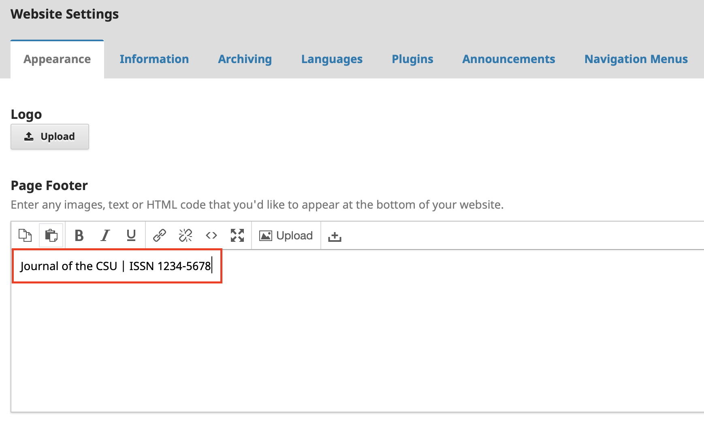
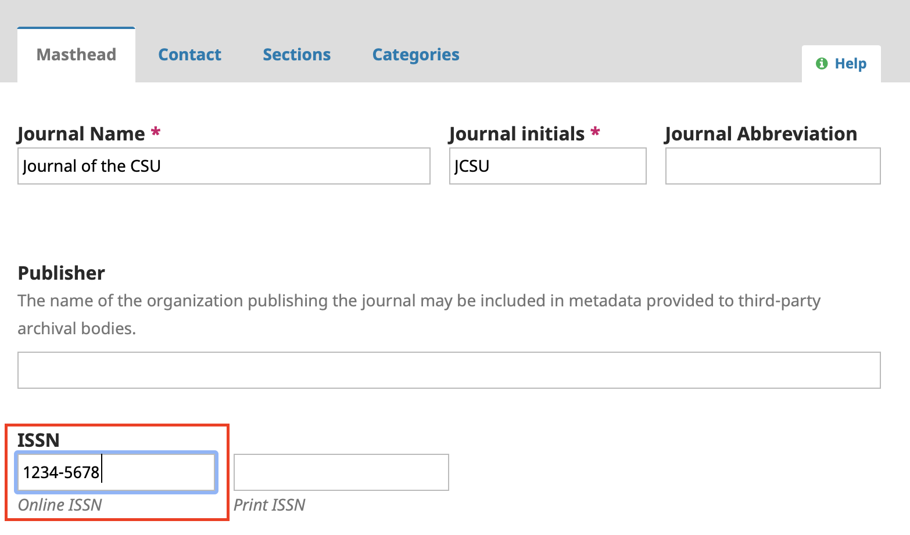

## ISSN

Applying for an ISSN (International Standard Serial Number) for your journal is an important step for discoverability and identification purposes. It is also required to opt into the [PKP Preservation Network](https://pkp.sfu.ca/pkp-pn/), which is strongly recommended as a means of ensuring permanent access to your journal content.

You can apply for an ISSN for free through the [U.S. ISSN Center](http://www.loc.gov/issn/), and further instructions as well as the application form are available at the following link: http://loc.gov/issn/form/. Note that a separate ISSN is needed for online and print versions, if applicable.

Once you receive the ISSN for your journal, you should add it to the [masthead metadata](https://docs.pkp.sfu.ca/learning-ojs/en/journal-setup#masthead) as well as the footer in OJS.

