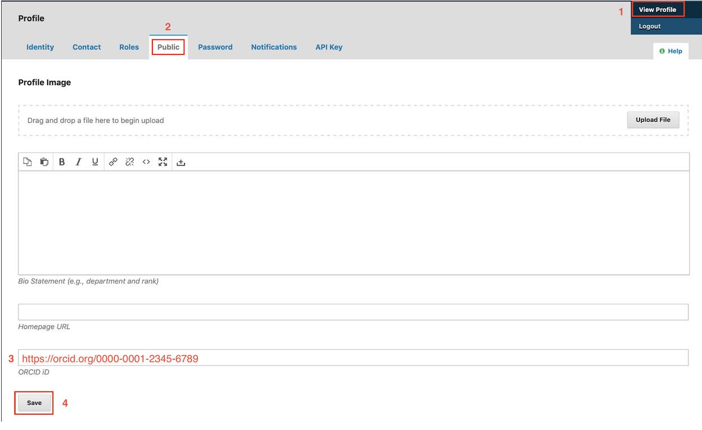

## ORCID
[ORCID](https://orcid.org/) is a nonprofit organization best known for enabling scholarly authors to [register](https://orcid.org/register) for free ORCID IDs. These are persistent 16-digit numbers intended to uniquely identify authors and address issues related to author name ambiguity.

The CSU libraries strongly recommend that journals encourage all authors to register for an ORCID iD and include this information in their OJS profile. After registering with your journal, authors can [view their profile](https://docs.pkp.sfu.ca/learning-ojs/en/user-accounts#viewing-and-changing-your-profile) and add their ORCID iD as well as a profile image and bio statement to the corresponding field within the Public tab.

