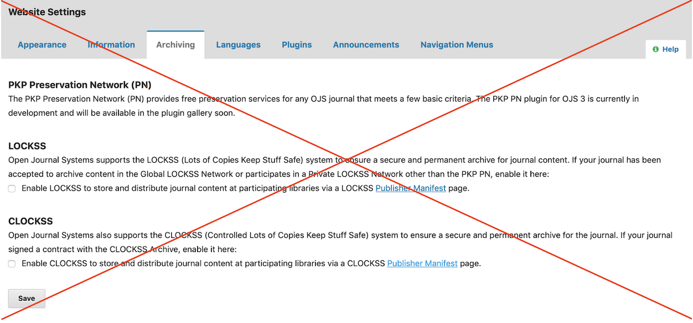

### CSU Contacts
For help setting up a new journal in OJS, enabling plugins, and troubleshooting technical issues, please contact [Systemwide Digital Library Services](https://www2.calstate.edu/csu-system/administration/sdls/Pages/about-us.aspx).

More general questions about journal support and publishing best practices can be directed to the CSU’s [Publishing Interest Group](https://calstate.atlassian.net/wiki/spaces/COLD/pages/79761063/Publishing+Interest+Group).

### DOIs
As of Summer 2020, Systemwide Digital Library Services became a member of CrossRef. Contact [Systemwide Digital Library Services](https://www2.calstate.edu/csu-system/administration/sdls/Pages/about-us.aspx) for more information on creating DOIs for OJS journals.

### PKP Private LOCKSS Network
All OJS journals that have an ISSN and have published at least one article are eligible to participate in the [PKP Private LOCKSS Network](https://pkp.sfu.ca/2016/08/08/pkp-lockss-pln-update/) (PLN) at no cost. The CSU libraries strongly recommend that journals take advantage of this opportunity and contact your [library publishing contact](contacts.md) for more information.

The [LOCKSS](https://www.lockss.org/) (Lots of Copies Keep Stuff Safe) Program was launched by Stanford Libraries in 1999, and it relies on open source software to provide digital preservation support to more than 1,000 publishers.

Do not enable archiving under Website Settings unless your journal or institution has a separate agreement with LOCKSS or CLOCKSS. Check with your [library publishing contact](contacts.md) if you have questions or concerns.

