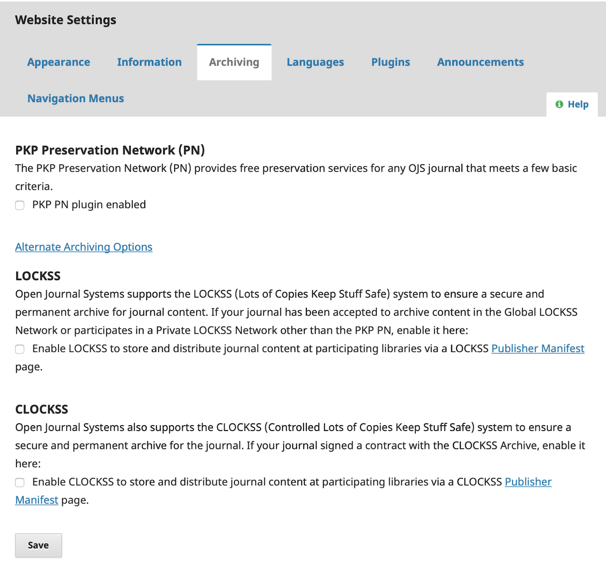

## Archiving
There are several archiving options for OJS journals, all of which are accessible from Settings > Website Settings > Archiving.

Any OJS journal that has an ISSN and has published at least one article can opt into the [PKP Private LOCKSS Network](https://pkp.sfu.ca/2016/08/08/pkp-lockss-pln-update/) (PLN) at no cost. This is strongly recommended, and you can contact the director of [Systemwide Digital Library Services](https://www2.calstate.edu/csu-system/administration/sdls/Pages/about-us.aspx) for assistance with the setup process. If this option does not appear under the Archiving options, the plugin may need to be re-installed.

If your library is a member of [LOCKSS](https://www.lockss.org) or [CLOCKSS](https://clockss.org) and has the ability to archive journal content, you can also click Alternate Archiving Options and select the appropriate option.

