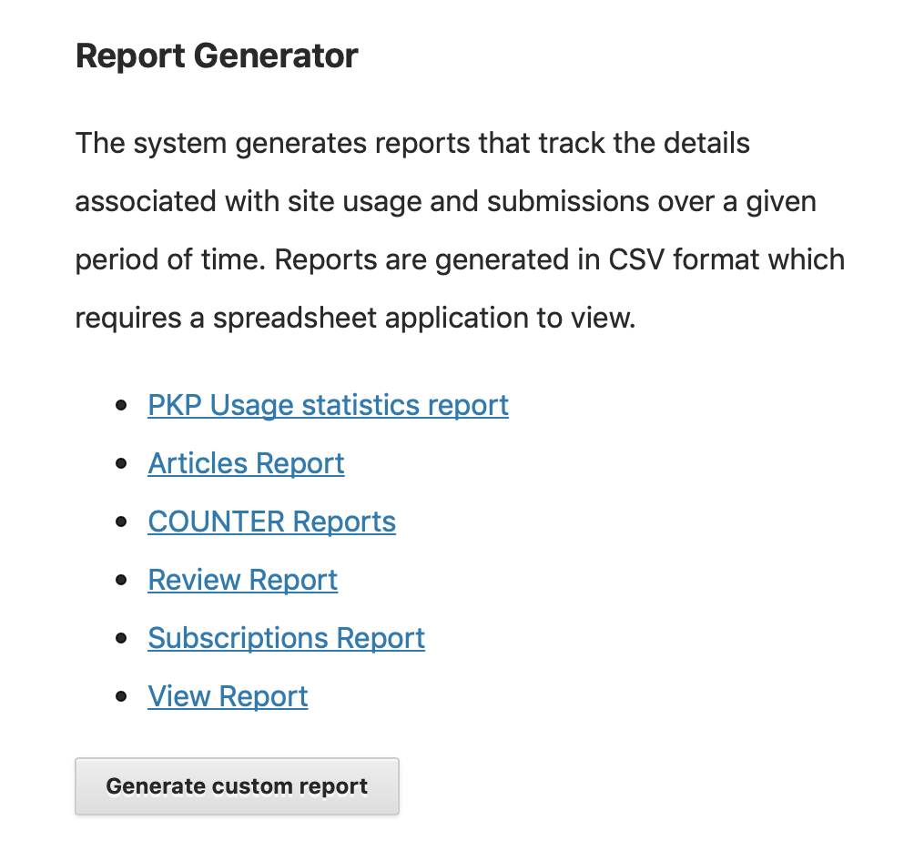

## Metrics

OJS journal managers can access a variety of metrics by clicking the “Statistics” tab in the left sidebar of the dashboard. Below is more detailed information about article-level metrics, but additional statistics related to peer review and editorial processes are also available. See the [PKP’s documentation](https://docs.pkp.sfu.ca/admin-guide/en/statistics#frequently-asked-questions) for more information.

## OJS Article-Level Metrics

If you click the “Articles” tab, this will display a graphical representation of total abstract views over time as well as a chart that includes abstract views, file views (broken down into PDF and HTML views), and other views (i.e., corresponding to other file types). Note that the date range defaults to the last 30 days, but this can be modified, as needed.

If you click the “Report Generator” tab, you can then choose from a number of default reports, which will download as CSV files. Note that the “PKP Usage statistics report” includes article-level download counts, while the “View Report” includes the same article-level statistics described above.

Alternatively, you can click the “Generate custom report” button, which will give you many more options. For more information about how to use this feature, see the [PKP’s documentation](https://docs.pkp.sfu.ca/admin-guide/en/statistics#generate-reports-examples-and-tips).

## Displaying OJS Article-Level Metrics

If you would like to display article-level metrics publicly, you will need to add and configure the Usage Statistics Plugin (Settings > Website > Plugins). See the [PKP’s documentation](https://docs.pkp.sfu.ca/admin-guide/en/statistics#display-usage-statistics-for-readers) for further instructions.

## Third-Party Metrics

OJS also supports additional plugins to integrate third-party metrics, and you can review the available plugins by going to Settings > Website > Plugins. Note that some plugins will require an external account (e.g., the Google Analytics Plugin) and/or a subscription (e.g., the Plum Analytics Artifact Widget). Please check with your [library publishing contact](contacts.md) to learn more about whether these services are part of the publishing program at your library.
