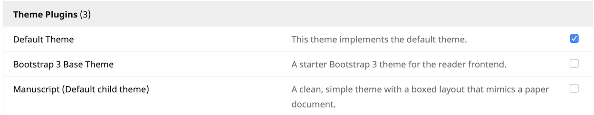

## Website Settings
When finished with your journal settings, click Settings in the left sidebar, and select Website. You can again follow along with the [PKP documentation](https://docs.pkp.sfu.ca/learning-ojs/en/settings-website), which will help you customize the look and feel of your journal website.

### Appearance
At this time, most CSU libraries will be unable to provide in-depth support with graphics or journal stylesheets. However, the PKP provides additional documentation for [designing your journal](https://docs.pkp.sfu.ca/designing-your-journal/en/).

Note that you can change the default theme by navigating to the Plugins tab, scrolling down to Theme Plugins, and checking the installed options to enable them. You should then be able to test out the various themes.

If you have questions, would like to request minor customizations, or run into technical difficulties, please email your [library publishing contact](contacts.md).

### Archiving
It is very important to identify an archiving (also known as digital preservation) strategy for your journal to ensure long-term access to the content.

As stated in the [Principles of Transparency and Best Practice in Scholarly Publishing](https://doaj.org/bestpractice):

> A journal's plan for electronic backup and preservation of access to the journal
> content (for example, access to main articles via CLOCKSS or PubMedCentral) in the
> event a journal is no longer published shall be clearly indicated.

Please email your [library publishing contact](contacts.md) to discuss the options available to your journal before making any changes on this page.

### Plugins
There are a growing number of plugins available for OJS that can be very helpful for enhancing certain features. You are welcome to [browse available plugins](https://docs.pkp.sfu.ca/learning-ojs/en/settings-website#plugins), but please do not attempt to install them yourself. Email your [library publishing contact](contacts.md), and they will forward your request to Systemwide Digital Library Services.
