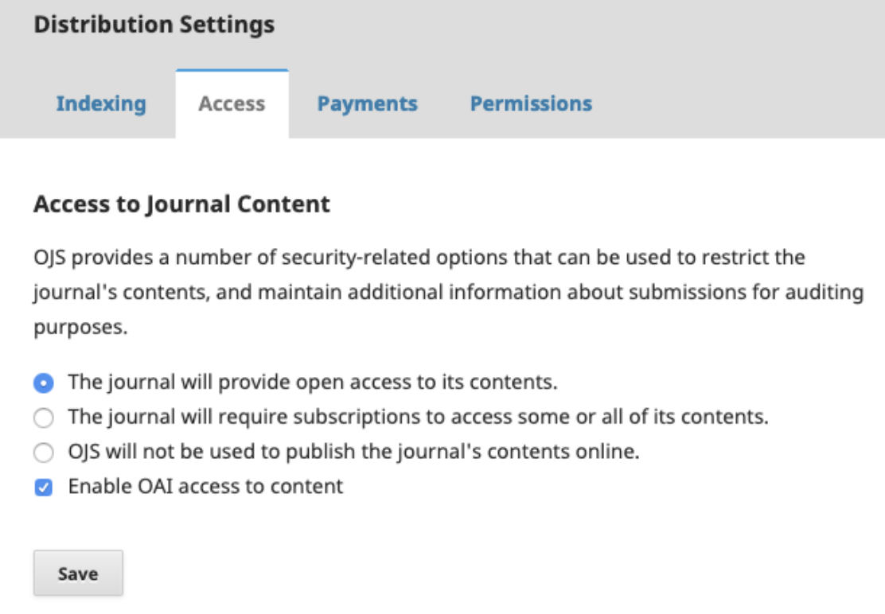
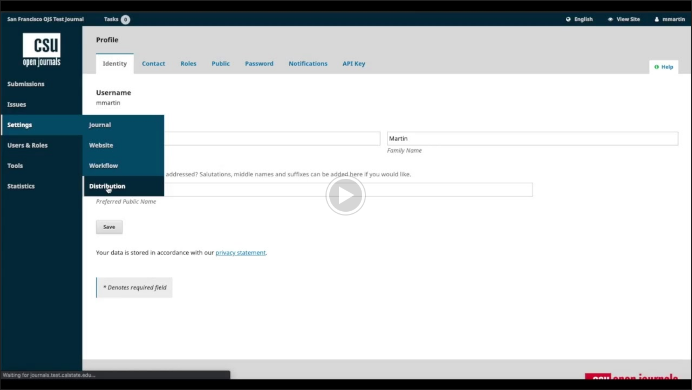

Your [library publishing contact](contacts.md) will work with the CSU’s Systemwide Digital Library Services to create an OJS account for your journal. Once that process is complete, you should familiarize yourself with the platform. The PKP’s [introduction](https://docs.pkp.sfu.ca/learning-ojs/en/introduction#ojs-features) to OJS provides a brief overview of the various features.

## Distribution Settings
Finally, click Settings in the left sidebar, and this time select Distribution. Once again, follow along with the corresponding [PKP documentation](https://docs.pkp.sfu.ca/learning-ojs/en/settings-distribution) to add information regarding Indexing, Access, Payments (if applicable), and Permissions.

### Indexing
In addition to the [Distribution Settings](https://docs.pkp.sfu.ca/learning-ojs/en/settings-distribution#search-indexing) documentation, you may also wish to consult the PKP’s recommendations for search engine optimization in their [Getting Found: Building Visibility](https://docs.pkp.sfu.ca/learning-ojs/en/settings-distribution#search-indexing) guide.

The [Promoting your Journal](promote.md) section of this guide includes additional general information about and resources for [indexing](promote.md).

### Access
In most cases, journals should not alter the default Access settings. If you have questions, please consult the [Open Access](establish3.md) policy section of this guide and/or email your [library publishing contact](contacts.md).

### Payments
Journals that receive support from a CSU library must not charge subscription fees. As noted in the [Get Started](start1.md) section, if your journal wishes to charge author fees (also known as article processing charges), you will be responsible for managing them.

The PKP’s [Distribution Settings](https://docs.pkp.sfu.ca/learning-ojs/en/settings-distribution#payments) documentation describes how to enable payments. Once completing those steps, you should consult the [Subscriptions](https://docs.pkp.sfu.ca/learning-ojs/en/subscriptions#payment-types) documentation, which includes information on author fees.

### Permissions
Before filling out the information on the Permissions page, please consult the [Copyright and Licensing](https://docs.google.com/document/d/19STrqDEmofW5Rgr85GRDLxoziN148mJNpbW0yFWhp5k/edit#heading=h.f4uq014p19v2) section of this guide. Once you decide on your journal’s copyright policy and default license, the following video will walk you through how to add this information to OJS.

When publishing individual articles, you will also have the opportunity to amend the copyright and licensing information, if needed.
